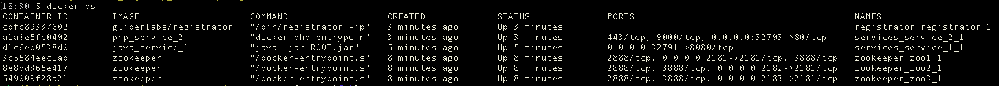
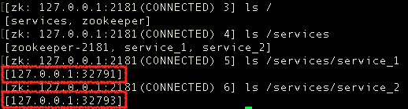
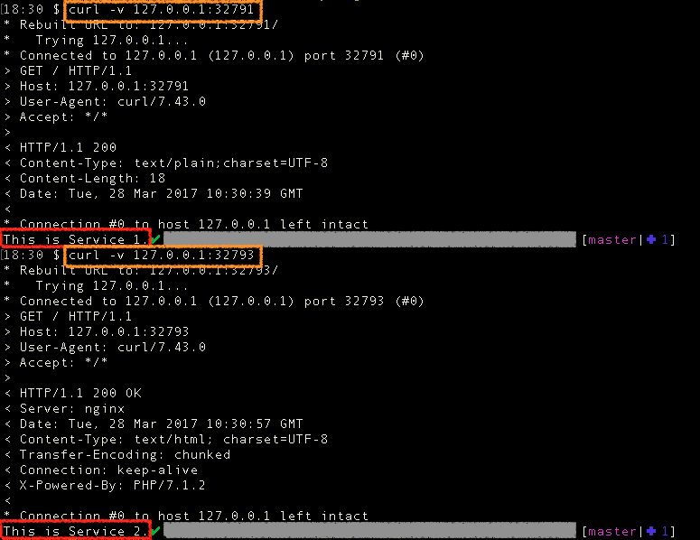

# service_registry_discovery

基于Registrator、ZK（Zookeeper）以及docker实现的服务注册与发现。本项目为展示Demo，供大家学习使用。

## 功能点
* 基于Registrator的服务自动注册；
* 基于ZK实现的分布式、高可用的服务注册中心；
* 基于docker实现的服务容器化部署；

## 当前环境
1. docker=1.12.1
2. docker-compose=1.8.0

## 启动
### 运行ZK
```
cd zookeeper && docker-compose up -d
```

### 运行服务（包含JAVA、PHP）
```
cd .. //返回根目录
cd services && docker-compose up -d
```

### OR 运行多个 service_1 服务(JAVA)
```
docker-compose up -d service_1
docker-compose scale service_1=num //num为运行个数
```

### 运行Registrator
```
cd registrator && docker-compose up -d
```

## 验证
### 查看容器启动情况


### 连接ZK，查看节点信息
```
# 访问运行时容器
docker exec -it zookeeper_zoo1_1 /bin/bash

# 连接ZK
zkCli.sh -server 127.0.0.1:2181
```


### 调用服务

